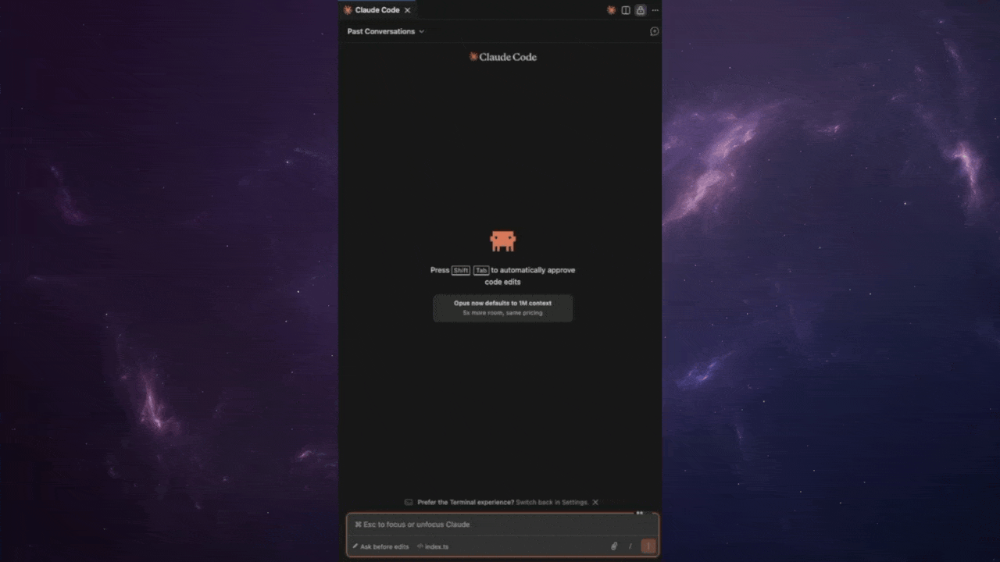
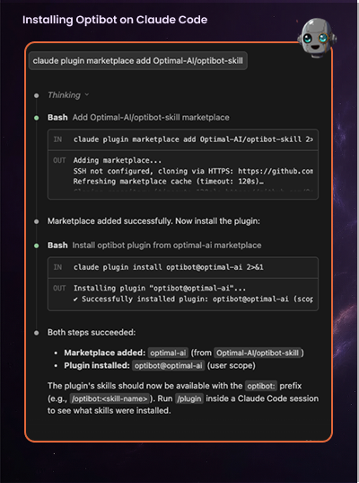

```
 ██████╗ ██████╗ ████████╗██╗██████╗  ██████╗ ████████╗
██╔═══██╗██╔══██╗╚══██╔══╝██║██╔══██╗██╔═══██╗╚══██╔══╝
██║   ██║██████╔╝   ██║   ██║██████╔╝██║   ██║   ██║   
██║   ██║██╔═══╝    ██║   ██║██╔══██╗██║   ██║   ██║   
╚██████╔╝██║        ██║   ██║██████╔╝╚██████╔╝   ██║   
 ╚═════╝ ╚═╝        ╚═╝   ╚═╝╚═════╝  ╚═════╝    ╚═╝   
          ── AI Code Review for Claude Code ──
```

[](LICENSE)
[](https://claude.ai/claude-code)
[](https://www.npmjs.com/package/optibot)

A [Claude Code](https://claude.ai/claude-code) plugin that brings [Optibot](https://getoptimal.ai) AI-powered code reviews directly into your coding workflow. Optibot catches production-breaking bugs, surfaces business logic issues, and strengthens security — all without leaving Claude Code.

> **What is a Claude Code plugin?**
> Claude Code plugins extend Claude's capabilities with new skills, tools, and integrations. Once installed, this plugin lets Claude run Optibot reviews on your behalf — just ask in natural language. Learn more about [Claude Code plugins](https://docs.anthropic.com/en/docs/claude-code/plugins).

## Installation

# Optibot Plugin for Claude Code

A **Claude Code** plugin that brings **Optibot** AI-powered code reviews directly into your coding workflow. Optibot catches production-breaking bugs, surfaces business logic issues, and strengthens security — all without leaving Claude Code.

## Requirements

- [Claude Code](https://claude.ai/claude-code)
- An [Optibot account](https://agents.getoptimal.ai/signup) (free to start)

## Installation Options

### Option 1: Inside a Claude Code Session (VS Code or Terminal)

1. Type `/plugin` in the Claude Code chat to open the **Plugin Manager UI**
2. Navigate to the **Marketplace** tab
3. Add the Optibot marketplace repo: `Optimal-AI/optibot-skill`
4. Go to the **Discover** tab
5. Find **Optibot** and press **Enter** to install
6. Run `/reload-plugins` to activate it



---

### Option 2: CLI (Terminal)

> **Note:** These commands are run in your regular terminal, not inside a Claude Code session.

Add the marketplace:
```bash
claude plugin marketplace add Optimal-AI/optibot-skill
```

Install the plugin:
```bash
claude plugin install optibot@optimal-ai
```

---




## Verifying Installation

After installing, run `/reload-plugins` inside your Claude Code session to load the plugin. You can confirm it's active by typing `/help` and looking for Optibot commands.


## Getting Started

Authenticate with your Optibot account:

```bash
optibot login
```

Then open Claude Code and say **"review my changes"** — you're good to go.

Don't have an account? [Sign up free →](https://agents.getoptimal.ai/signup)

## What It Does

Once installed, Claude Code can:

- **Review your code** — just say "review my changes" and Claude runs the review for you
- **Compare branches** — "review my branch against main" triggers a branch diff review
- **Review patch files** — point it at any `.patch` or `.diff` file
- **Manage API keys** — create, list, and delete keys for CI/CD
- **Fix issues** — Claude reads the review feedback and offers to apply fixes directly

<!-- ## Demo -->
<!--  -->

## Usage

After installing the plugin, just ask Claude naturally:

| What you say | What happens |
|---|---|
| "review my changes" | Reviews uncommitted local changes |
| "review my branch" | Compares current branch against main |
| "review this diff" | Reviews an arbitrary patch file |
| "set up optibot" | Walks you through auth setup |
| "create an API key for CI" | Creates and displays a new API key |

## Authentication

**Interactive** — run `optibot login` to authenticate via browser (90-day token).

**CI/CD** — set `OPTIBOT_API_KEY=optk_...` as an environment variable.

## CI/CD Integration

```yaml
# GitHub Actions
- name: Optibot Review
  env:
    OPTIBOT_API_KEY: ${{ secrets.OPTIBOT_API_KEY }}
  run: npx optibot review -b main
```

## Uninstalling

```bash
claude plugin uninstall optibot
```

## Contributing

Contributions are welcome! See [CONTRIBUTING.md](CONTRIBUTING.md) for guidelines.

## Links

- [Optibot Website](https://getoptimal.ai)
- [Sign Up (Free)](https://agents.getoptimal.ai/signup)
- [Report an Issue](https://github.com/Optimal-AI/optibot-skill/issues)
- [Claude Code](https://claude.ai/claude-code)
- [Claude Code Plugins](https://docs.anthropic.com/en/docs/claude-code/plugins)

## License

MIT — see [LICENSE](LICENSE) for details.  
Copyright (c) 2026 Optimal AI, Inc.
